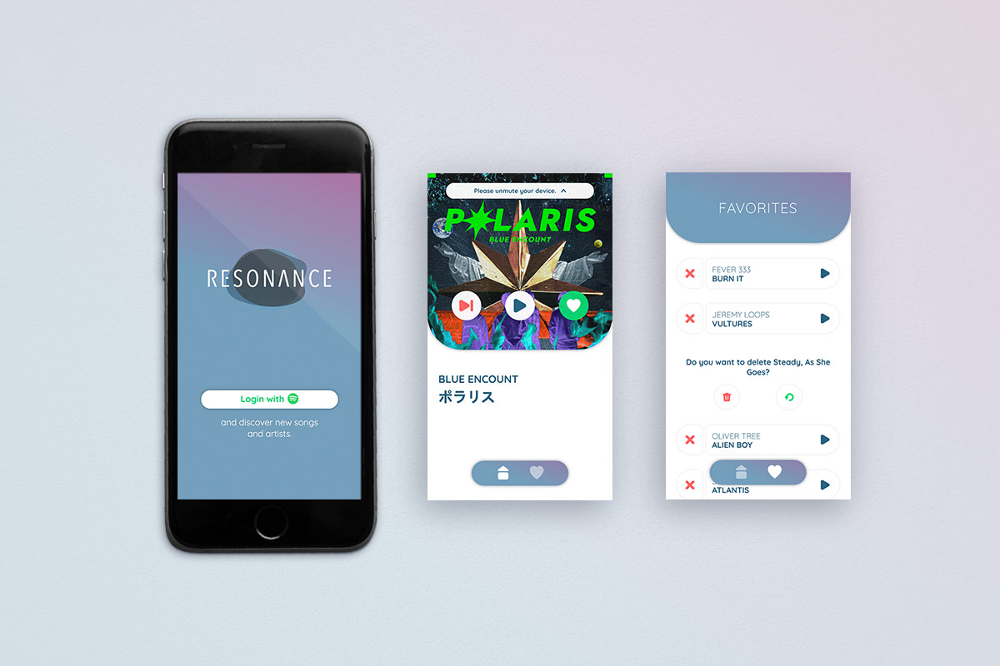

**"resonance" is a browser app for music lovers who are open to new discoveries.**

## Motivation

This project was created as part of my graduation from the neuefische coding bootcamp.\
I am a great music enthusiast myself and can never get enough of new inspiration. So I developed an app that helps to discover and manage new artists quick and easy.

## Main Features

Songs from the Spotify Web API are fetched randomly and displayed appropriately. The user can listen to the song for 30 seconds, pause it, play it again, save or skip it.\
The saved songs are shown in an overview. There the user can listen to the song snippets or sort them out.

## Mockup

## Demo

You can test the app in [this demo](https://resonance-app.herokuapp.com). It is optimized for **mobile screens**.

---

 

## Tech Stack

- React
- React Router
- React Hooks
- Howler.js
- Framer Motion
- Styled Components
- Styleguidist
- React Testing Library
- JEST
- Cypress
- Node.js

**API Reference**

- [Spotify Web API](https://developer.spotify.com/documentation/web-api/)
- [Spotify Web API JS](https://github.com/JMPerez/spotify-web-api-js)

---

## How to use?

`$ npm install`

Installs all packages.

`$ npm test`

Verify that the project runs without errors.

`$ npm run prettify`

If the test run shows a formatting error.

`$ npm run styleguide`

Check out the components.

`$npm run build`

Builds the app for production to the `build` folder.

`$ npm run dev`

Runs the app and server in the development mode. Open [http://localhost:3000](http://localhost:3000) to view the app in the browser.

`$ mv .env.example .env`

You need a Client ID, Client Secret and Redirect URI from the Spotify Web API.

---

## License

[MIT](https://en.wikipedia.org/wiki/MIT_License#License_terms) © Nina Peters

---

Thanks for this intense and great time and for all your support!\
[neuefische GmbH ](https://github.com/neuefische)
