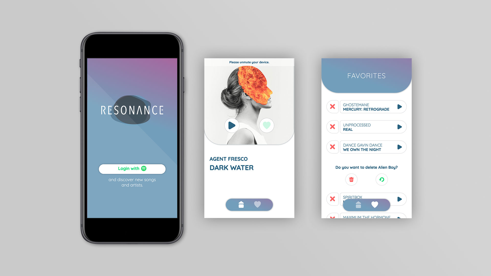

# resonance

"resonance" is a browser app for music lovers who are open to new discoveries.

## Motivation

This project was created as part of my graduation from the neuefische coding bootcamp.\
I am a great music enthusiast myself and can never get enough of new inspiration. So I developed an app that helps to discover and manage new artists quick and easy.

## Screenshots

---
## Framework 

This project was bootstrapped with [Create React App](https://github.com/facebook/create-react-app).

**Other tools that I used**

- [howler.js](https://howlerjs.com/)
- [styleguidist](https://react-styleguidist.js.org/)
- [styled-components](https://styled-components.com/)
- [PropTypes](https://www.npmjs.com/package/prop-types)
- [Spotify Web API Node](https://github.com/thelinmichael/spotify-web-api-node)

**API Reference**
- [Spotify Web API](https://developer.spotify.com/documentation/web-api/)

## How to use?

`$ npm install`

Installs all packages.

`$ npm test`

Verify that the project runs without errors.

`$npm run build`

Builds the app for production to the `build` folder.\
It correctly bundles React in production mode and optimizes the build for the best performance.

The build is minified and the filenames include the hashes. The app is ready to be deployed!

### **Client**

`$ npm start`

Runs the app in the development mode.\
Open [http://localhost:3000](http://localhost:3000) to view it in the browser.

### **Server**

`$ mv .env.example .env` 

You need a Client ID and a Client Secret from the Spotify Web API.

`$ npm run dev` 

Runs the app in the development mode.\
Open [http://localhost:3001](http://localhost:3001) to view it in the browser.

`$ npm run build && npm start` 

For production.

---
## Credits

Thanks for this intense and great time and for all your support!\
[neuefische GmbH ](https://github.com/neuefische)

## License
[MIT](https://en.wikipedia.org/wiki/MIT_License#License_terms) 