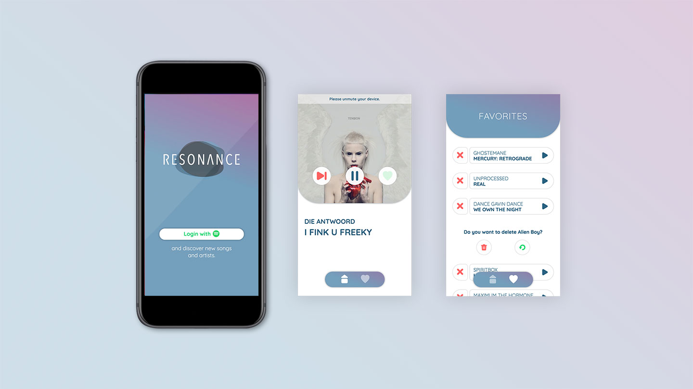

"resonance" is a browser app for music lovers who are open to new discoveries.

## Motivation

This project was created as part of my graduation from the neuefische coding bootcamp.\
I am a great music enthusiast myself and can never get enough of new inspiration. So I developed an app that helps to discover and manage new artists quick and easy.

## Mockup

---

## Tech Stack

- React
- React Router
- React Hooks
- Howler.js
- Styled Components
- PropTypes
- Styleguidist
- React Testing Library
- JEST
- Cypress
- Node.js
- Express.js

**API Reference**

- [Spotify Web API](https://developer.spotify.com/documentation/web-api/)
- [Spotify Web API JS](https://github.com/JMPerez/spotify-web-api-js)

---

## How to use?

`$ npm install`

Installs all packages.

`$ npm test`

Verify that the project runs without errors.

`$ npm run prettify`

If the test run shows a formatting error.

`$ npm run styleguide`

Check out the components.

`$npm run build`

Builds the app for production to the `build` folder.

`$ npm run dev`

Runs the app and server in the development mode.

### **Server**

`$ mv .env.example .env`

You need a Client ID and a Client Secret from the Spotify Web API.

### **Client**

`$ npm start`

Runs the app in the development mode.\
Open [http://localhost:3000](http://localhost:3000) to view it in the browser.

---

## License

[MIT](https://en.wikipedia.org/wiki/MIT_License#License_terms)

---

Thanks for this intense and great time and for all your support!\
[neuefische GmbH ](https://github.com/neuefische)
